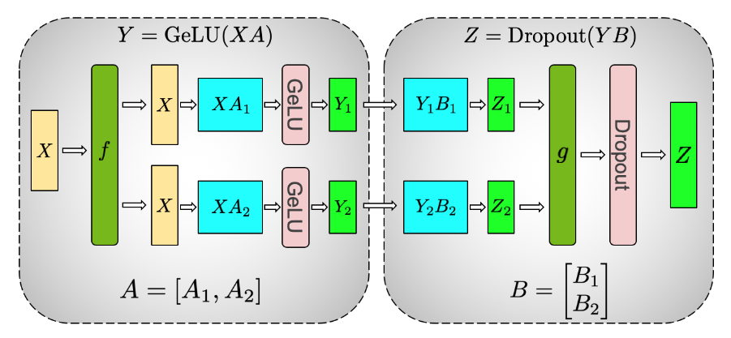
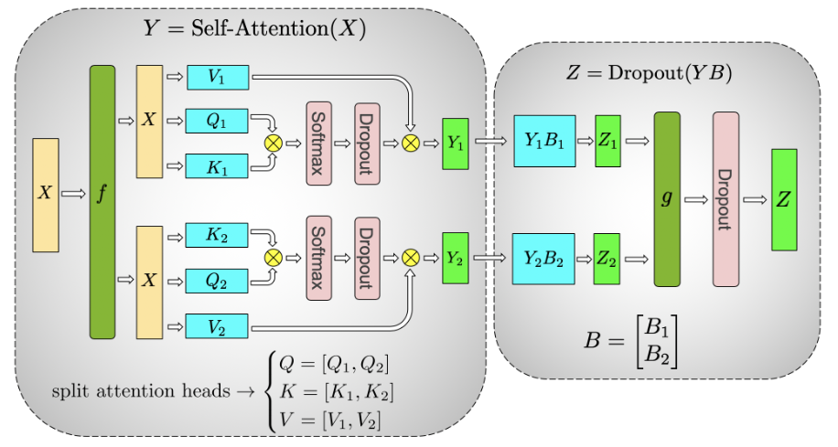
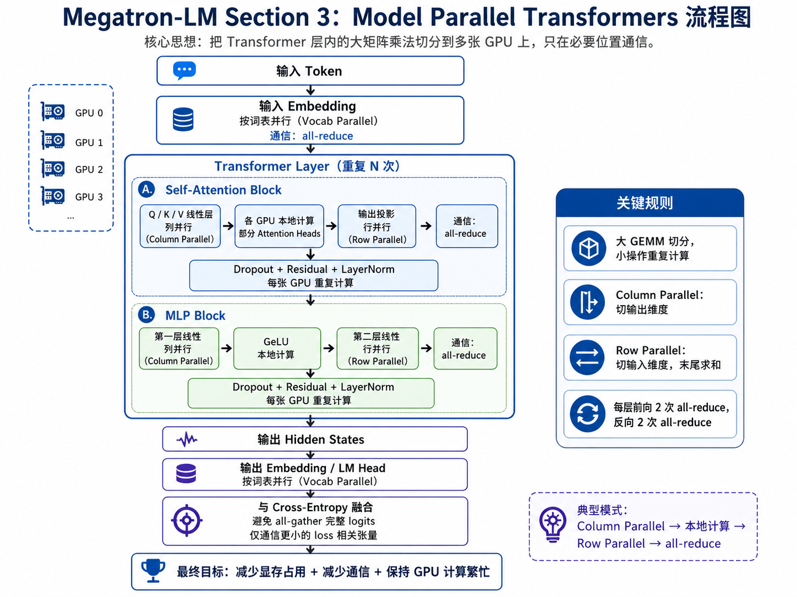

# Megatron-LM
数据并行的并行度通常来自 batch 维度，模型并行的并行度来自模型结构本身

对于大语言模型来说，模型并行更关键，因为模型规模本身已经超过单卡显存

模型并行的两大路线：
* layer-wise pipeline parallelism
* distributed tensor computation

| 概念                             | 做法                     | 优点                 | 限制                                 |
| ------------------------------ | ---------------------- | ------------------ | ---------------------------------- |
| 数据并行                           | 每张 GPU 放完整模型，切 batch   | 简单，吞吐扩展好           | 模型必须单卡放得下                          |
| Activation checkpointing       | 反向时重算激活                | 降低激活显存             | 不减少参数和优化器状态                        |
| Parameter sharing              | 多层共享参数                 | 降低参数显存             | 限制模型容量                             |
| Pipeline parallelism           | 按层切模型                  | 能训练更大模型            | pipeline bubble，调度复杂               |
| Distributed tensor computation | 切单个 tensor operation   | 细粒度，高效切大矩阵         | 需要设计通信和张量切分                        |
| Megatron-LM                    | 针对 Transformer 做层内张量并行 | 简单、PyTorch 可实现、通信少 | 需要理解 Transformer 结构和 collective 通信 |

## Model Parallel Transformers
Transformer 的主要计算 = 大矩阵乘法 GEMM

↓

把这些 GEMM 按合适维度切到多张 GPU 上

↓

每张 GPU 只保存一部分权重、计算一部分输出

↓

只在必要位置做 all-reduce

↓

减少显存压力，同时保持较高计算效率

一个典型 Transformer 层可以简化成：

输入 X

↓

Self-Attention

↓

Residual + LayerNorm / Dropout

↓

MLP / Feed-forward

↓

Residual + LayerNorm / Dropout

↓

输出

### MLP block 并行
Transformer 的 MLP 通常有两层线性变换，中间接 GeLU：
$$Y = GeLU(XA)$$

#### 第一层 MLP
一种直观切法是：
$Y = GeLU(X_1A_1 + X_2A_2)$，由于 GeLU 是非线性函数，$GeLU(X_1A_1 + X_2A_2) \neq GeLU(X_1A_1) + GeLU(X_2A_2)$

另一种选择是沿列拆分 $A$，即 $A = [A_1, A_2]$，这种拆分方式允许将 GeLU 非线性函数独立地应用于每个拆分后的 GEMM 输出：
$$[Y_1, Y_2] = [GeLU(XA_1), GeLU(XA_2)]$$
每张 GPU 可以独立计算自己的那一部分输出，并且独立做 GeLU，不需要先同步

#### 第二层 MLP
MLP 第二层通常把维度从 4H 投影回 H，设第二层权重为：
$$B \in \mathbb{R}^{4H \times H}$$
因为第一层输出已经被切成：
$$[Y_1, Y_2]$$
所以第二层权重 $B$ 应该按 **行方向** 切：
$$B = \begin{bmatrix} B_1 \\ B_2 \end{bmatrix}$$
完整输出是：
$$Z = Z_1 + Z_2$$
所以第二层之后需要一次 all-reduce，把各 GPU 的部分输出求和。第一层 column parallel，第二层 row parallel，使第二层可以直接接收 GeLU 后的分片输出，不需要中间通信；最后只在第二个 GEMM 输出后 reduce

所以 MLP block 的前向传播只需要一次 all-reduce，反向传播中也需要对应的一次 all-reduce

第一层列并行，第二层行并行，中间不通信，末尾再同步

#### f 和 g 操作
论文引入两个共轭算子：f 和 g

f 算子的核心特点是（输入端）：
* 前向传播 (Forward pass)：作为一个恒等算子，它对输入数据不进行任何处理，直接原样输出
* 反向传播 (Backward pass)：执行 all-reduce 通信操作。当反向传播计算到此处时，它会将分布在同一模型并行组内各 GPU 上的梯度张量进行求和合并，确保每个 GPU 都能获得针对该节点输入的完整梯度

```python
class f(torch.autograd.Function):
    def forward(ctx, x):
        return x # 前向传播：无通信，原样返回

    def backward(ctx, gradient):
        all_reduce(gradient) # 反向传播：在各 GPU 间规约梯度 
        return gradient
```
g 算子的行为正好与 f 完全相反（输出端）：
* 前向传播 (Forward pass)：执行 all-reduce 通信操作 。它会将来自多个 GPU 的局部计算结果进行求和合并，拼出最终完整的前向特征图输出
* 反向传播 (Backward pass)：作为一个恒等算子，不进行任何通信，直接将接收到的误差梯度反向传递给前面的层



### Self-Attention 并行
Multi-head attention 本身就有天然并行性，因为不同 attention head 可以相对独立计算。利用这一点，把 Q、K、V 对应的 GEMM 按列切分，使每张 GPU 负责一部分 attention heads

在标准 Transformer 中：
$$Q = XW_Q$$
$$K = XW_K$$
$$V = XW_V$$
其中 $W_Q, W_K, W_V$ 通常输出完整 hidden size，然后再 reshape 成多个 heads

把 $W_Q, W_K, W_V$ 都按列切，也就是说，每张 GPU 只负责一部分输出维度，对应一部分 attention heads

这样每张 GPU 可以本地完成自己 heads 的 attention 计算，不需要立刻和其他 GPU 通信

在 attention heads 计算完之后，会有一个输出线性层：

$$OW_O$$

由于前面的 attention 输出已经按 head 分片保存在不同 GPU 上，所以 $W_O$ 适合按行切分
```
GPU 1: 本地 heads 输出 × W_O 的对应行分片
GPU 2: 本地 heads 输出 × W_O 的对应行分片
...
最后 all-reduce 求和
```

一个模型并行 Transformer 层中，总共有 4 个通信操作：
| 模块             |     Forward 通信 |    Backward 通信 |
| -------------- | -------------: | -------------: |
| Self-Attention | 1 次 all-reduce | 1 次 all-reduce |
| MLP            | 1 次 all-reduce | 1 次 all-reduce |
| 合计             |            2 次 |            2 次 |

### Embedding 并行
Transformer language model 还有一个很大的矩阵：embedding

输出 embedding 的维度是：
$$H \times v$$
- $H$：hidden size
- $v$：vocabulary size
Transformer language model 通常输入 embedding 和输出 embedding 共享权重，因此如果要并行输出 embedding，也要相应修改输入 embedding

#### 输入 embedding
输入 embedding 权重矩阵：
$$E \in \mathbb{R}^{H \times v}$$
沿 vocabulary dimension 切分：
$$E = [E_1, E_2]$$
每张 GPU 只保存一部分词表的 embedding，由于每个 partition 只包含 embedding table 的一部分，所以 input embedding 后需要一个 all-reduce，也就是 $g$ 操作

#### 输出 embedding
输出层要计算 logits：
$$Y = XE$$
如果 embedding 按词表切分：
$$E = [E_1, E_2]$$
则每张 GPU 计算：
$$[Y_1, Y_2] = [XE_1, XE_2]$$
朴素做法是把 $Y_1, Y_2$ all-gather 成完整 logits：$$Y = \text{all\_gather}([Y_1, Y_2])$$然后送入 cross-entropy loss

但论文指出，这样通信量太大，因为 logits 的大小是：$$b \times s \times v$$
- $b$：batch size
- $s$：sequence length
- $v$：vocabulary size
由于 $v$ 很大，通信完整 logits 非常昂贵

**Megatron-LM 的优化：融合 output GEMM 和 cross-entropy loss**

为了减少通信，Megatron-LM 不 all-gather 完整 logits，而是把 parallel GEMM 的输出和 cross-entropy loss 融合
- 不要通信完整 logits: $b \times s \times v$
- 改为通信 loss 相关标量: $b \times s$
不要通信巨大中间张量，尽量把计算和 loss 合并，把通信压缩到更小维度

### 重复计算
为了减少通信并保持 GPU compute-bound，Megatron-LM 会选择在多张 GPU 上重复某些便宜操作，而不是通信它们的结果

这些被重复计算的操作包括：
- dropout
- layer normalization
- residual connection
与其让一个 GPU 计算这些操作的一部分然后广播给其他 GPU，不如每张 GPU 都自己算一遍

### 参数更新
不需要通信更新后的参数值
- 被切分的权重：每张 GPU 只拥有自己的分片
- 被复制的参数：例如 layer norm 参数，在模型并行组内复制
- 计算和梯度同步通过前面设计好的通信操作处理
- 不需要每一步都把“更新后的完整参数”广播给所有 GPU
