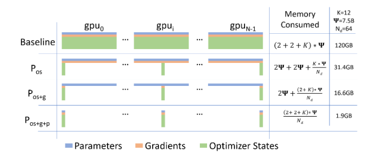

# ZeRO
## ZeRO 解决问题的高层逻辑
### 痛点：算力跟得上，显存却爆了
随着 NLP 领域 Transformer 架构的爆发，模型体积正在狂飙突进，比如从 Bert-large (0.3B) 一路涨到 T5 (11B)。但尴尬的是，单张 GPU 的显存根本装不下这些庞然大物。

- 传统数据并行彻底失效：DP 的做法是在每张显卡上都完整复制一份模型，然后把数据切分。因为每张卡都要装完整的模型，导致 32GB 的显卡在面对大于 14 亿 (1.4B) 参数的模型时直接 OOM

### 现有的方法为什么不够好
为了解决显存塞不下的问题，业界想过很多办法（比如模型并行、流水线并行、CPU卸载），但都有致命缺陷，其中被寄予厚望的模型并行表现最典型：

- MP 的原理与缺陷：MP 是把模型垂直切分，将一层网络的计算和参数分到多张卡上。这虽然解决了显存问题，但每一层计算完都需要极其频繁的通信

- 跨节点：在同一个物理节点里，MP 勉强能用 。但一旦模型大到需要跨节点训练，通信效率就会雪崩。作者亲测用 MP 跨两个节点训练 40B 模型时，GPU 的算力利用率连硬件峰值的 5% 都不到

### 内存占用
内存占用归为两大类：

- 模型状态：这是内存消耗的大头，包括优化器状态（比如 Adam 里的动量和方差）、梯度和参数

- 剩余状态：剩下的内存被激活值、临时缓冲区以及由于内存碎片化导致无法使用的空间占据

### ZeRO 解决方法
针对这两大类内存消耗，ZeRO 给出了对应的解决方案：

- 对付模型状态 -> ZeRO-DP：它保留了 DP 计算/通信效率高的优点，同时吸取了 MP 内存效率高的优点。不复制，只划分。通过三个渐进的阶段（划分优化器状态、划分梯度、划分参数），可以将这部分内存消耗最高减少 $N_d$ 倍

- 对付剩余状态 -> ZeRO-R：专门用来优化激活值、缓冲区大小，并主动管理内存防止碎片化

- $\Psi$：模型大小，图中的例子是 7.5B

- $N_d$：数据并行的进程数，图中的例子是 64 张卡

- $K$：优化器状态的内存乘数，对于混合精度下的 Adam 优化器，$K=12$

图中的长条代表显存占用：蓝色代表参数，橙色代表梯度，绿色的大头代表优化器状态 
