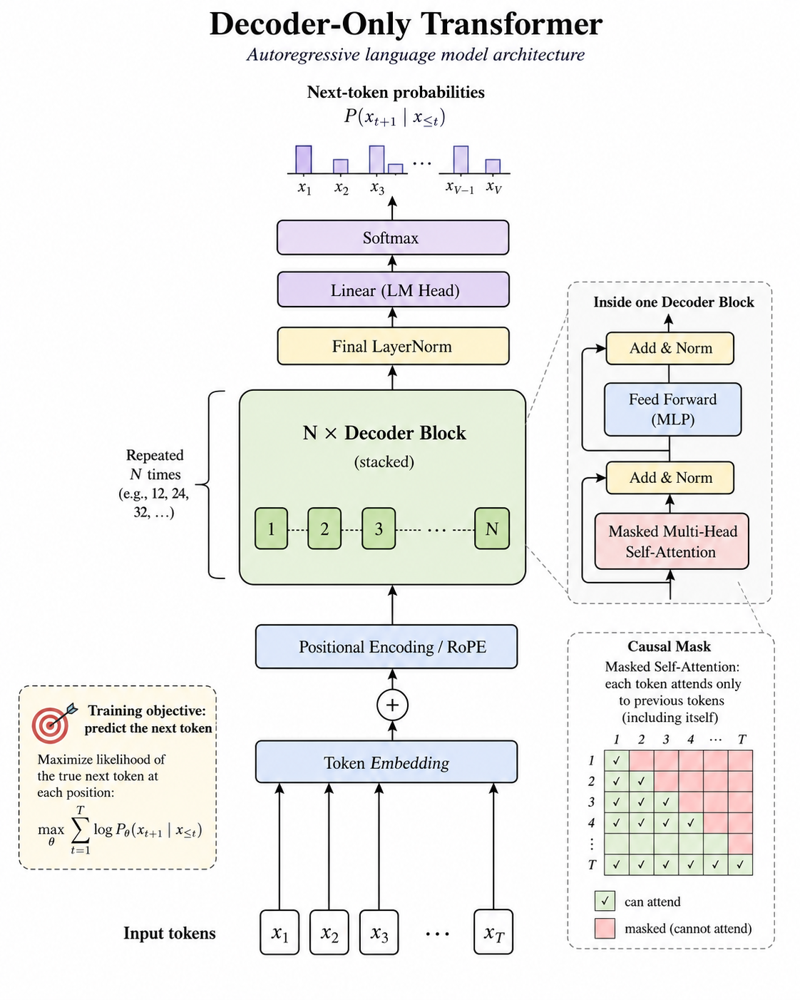

# Attention Mechanism

## 1. Attention 在做什么

Attention 的本质是：**根据当前 Token 与其他 Token 的相关性，对它们的信息进行加权汇总。**

输入 `X ∈ [B, S, H]` 经过三个线性投影：

```text
Q = XWq   # 当前 Token 想查询什么
K = XWk   # 每个 Token 能用什么特征被匹配
V = XWv   # 每个 Token 实际提供的信息
```

可以把它理解为：用 Q 和 K 计算匹配分数，再按分数对 V 求加权和。



## 2. Scaled Dot-Product Attention

核心公式：

```text
scores = QKᵀ / √d
weights = softmax(scores + mask)
output = weights × V
```

其中 `d` 是单个 Attention Head 的维度。

为什么除以 `√d`？当维度增大时，点积的数值范围也会变大，Softmax 容易进入饱和区域。缩放能让分数保持在较稳定的范围内。

为什么需要 Softmax？它把一行分数转换为和为 1 的权重，使模型能按相关程度组合多个 Token 的信息。

实际实现会使用数值稳定的 Softmax：

```text
softmax(xᵢ) = exp(xᵢ - max(x)) / Σ exp(xⱼ - max(x))
```

减去最大值不会改变结果，但能避免指数运算溢出。

## 3. Causal Mask

Decoder-only 模型不能看到未来 Token，因此位置 `i` 只能关注 `0...i`：

```text
Token 0: ✓ ✗ ✗ ✗
Token 1: ✓ ✓ ✗ ✗
Token 2: ✓ ✓ ✓ ✗
Token 3: ✓ ✓ ✓ ✓
```

实现时，未来位置的 score 会被加上 `-∞`，经过 Softmax 后权重变为 0。Mask 只限制信息流向，不减少普通 Attention 的理论计算复杂度。

## 4. Multi-Head Attention（MHA）

### 4.1 为什么需要多头

多头机制允许模型同时在多个不同的表示子空间中学习关系，例如局部依赖、长距离依赖或语义关联。每个 Head 都有自己的 Q、K、V 投影参数，不同 Head 的关注模式由训练学习得到，并非人为指定。

### 4.2 MHA 的计算流程与维度变化

设输入 `X: [B, S, H]`，其中 `B` 为批大小，`S` 为序列长度，`H` 为隐藏维度。使用 `h` 个 Head，每个 Head 的维度为 `d = H / h`。

1. **线性映射**：通过 `Q = XWq`、`K = XWk`、`V = XWv` 得到三个形状为 `[B, S, H]` 的张量。
2. **拆分多头**：先将隐藏维度拆成 `h × d`，再转置为 `[B, h, S, d]`，让各 Head 并行计算。
3. **缩放点积注意力**：每个 Head 按第 2、3 节的公式计算。`QKᵀ` 得到 Token 间的匹配分数，经过缩放、因果掩码和 Softmax 后，对 V 加权求和。
4. **拼接与输出投影**：各 Head 的输出转置并拼接回 `[B, S, H]`，再乘输出投影 `Wo: [H, H]`，整合各 Head 的信息。

```text
X                          [B, S, H]
  ↓ Q、K、V 投影
Q / K / V                  [B, S, H]
  ↓ 拆分 Head 并转置
Q / K / V                  [B, h, S, d]
  ↓ QKᵀ / √d + causal mask
scores / weights           [B, h, S, S]
  ↓ weights × V
每个 Head 的输出            [B, h, S, d]
  ↓ 转置并拼接，再经过 Wo
Attention 输出             [B, S, H]
```

## 5. 从 MHA 到 MQA、GQA 与 MLA

自回归生成需要反复使用历史 Token 的 K、V。将它们缓存为 **KV Cache**，可以避免每一步重新计算历史投影，但缓存容量和读取量会随上下文长度增长。

这些变体关注同一个问题：**如何在尽量保留多头注意力能力的同时，减少 KV Cache 的显存占用和读取带宽。** MQA、GQA 通过共享 KV Head 减少缓存，MLA 则使用低维潜变量表示 KV 信息。

### 5.1 MQA：所有 Query Head 共享一组 K、V

MHA 中每个 Query Head 都有独立的一组 K、V。例如，8 个 Query Head 对应 8 个 Key Head 和 8 个 Value Head。

**Multi-Query Attention（MQA）** 保留 8 个 Query Head，但只使用 1 个 Key Head 和 1 个 Value Head。所有 Query Head 使用同一套 K、V；由于 Q 不同，各 Head 仍可产生不同的注意力权重和输出。

这显著减小 KV Cache，但共享程度提高也会限制 KV 表示的自由度，模型质量取决于具体架构与训练。

### 5.2 GQA：每组 Query Head 共享一组 K、V

**Grouped-Query Attention（GQA）** 将 Query Head 分组，每组共享一个 Key Head 和一个 Value Head，在 MHA 与 MQA 之间提供折中。

例如，8 个 Query Head 分成 2 组，每组 4 个 Query Head，共享该组的 K、V。因此 K、V 各只有 2 个 Head。

- 当 `num_groups = num_heads` 时，GQA 退化为 MHA。
- 当 `num_groups = 1` 时，GQA 退化为 MQA。

### 5.3 统一维度对比

设 `H = 512`、Query Head 数为 8，则 `d = 64`。下表用 `S` 表示本次输入序列长度，GQA 使用 2 组：

| 机制 | Q 的形状 | K 的形状 | V 的形状 | 每个 KV Head 被几个 Query Head 共享 |
| --- | --- | --- | --- | ---: |
| MHA | `[B, 8, S, 64]` | `[B, 8, S, 64]` | `[B, 8, S, 64]` | 1 |
| MQA | `[B, 8, S, 64]` | `[B, 1, S, 64]` | `[B, 1, S, 64]` | 8 |
| GQA | `[B, 8, S, 64]` | `[B, 2, S, 64]` | `[B, 2, S, 64]` | 4 |

三者的 Query Head 数和最终输出形状相同，主要区别在 K、V 投影的输出宽度：`Wq: [H, num_heads × d]`，而 `Wk`、`Wv` 各为 `[H, kv_heads × d]`。共享 KV Head 不要求在缓存中为每个 Query Head 复制一份 K、V。

当各请求的缓存长度均为 `T` 时，这三种机制的 KV Cache 字节数为：

```text
2 × 层数 × B × T × kv_heads × d × 每个元素的字节数
```

其中 `2` 对应 K 和 V。在其他条件相同的情况下，本例 MQA 的缓存为 MHA 的 `1/8`，GQA 为 MHA 的 `1/4`。这降低了容量与读取带宽需求，但不意味着整体推理速度一定按相同比例提升。

### 5.4 MLA：缓存低维潜变量

**Multi-Head Latent Attention（MLA）** 的思路是将 KV 信息压缩为低维潜变量，推理时缓存压缩表示，各 Head 通过各自的投影使用其中的信息。

理解上的关键区别是：MHA、MQA、GQA 调整的是 **KV Head 的数量与共享方式**，MLA 调整的是 **KV 信息的表示与缓存方式**。这里先保留概念层面的介绍；具体缓存布局与位置编码处理需要结合模型实现分析。

## 6. Prefill 与 Decode 中的区别

### Prefill

Prompt 中所有 Token 同时计算，Attention Score 的形状近似为：

```text
[B, num_heads, S, S]
```

标准 Attention 的计算复杂度随序列长度呈 `O(S²)` 增长，中间 Score/Weight 矩阵也可能占用大量显存。FlashAttention 通过分块计算和在线 Softmax，避免把完整的 `S × S` 矩阵写回显存，主要优化数据搬运，而不是近似 Attention。

### Decode

每一步只输入一个新 Token，各 Query Head 分别产生一个新 Query。设追加当前 Token 的 K、V 后，可关注的 KV 总长度为 `T`（包含历史 Token 和当前 Token）：

```text
Q: [B, num_heads, 1, d]
K/V Cache: [B, kv_heads, T, d]
Attention Scores: [B, num_heads, 1, T]
```

单步 Attention 计算量约随上下文长度 `T` 线性增长。此时并行度较低，又要反复读取 KV Cache，因此通常更容易受到显存带宽限制。

KV Cache 保存历史 Token 已经计算好的 K、V，使 Decode 不必每一步重新处理完整上下文；代价是显存占用随序列长度增长。

## 7. 常见误区

- Attention 权重高表示当前计算中的相关性强，不一定等同于可解释的“重要性”。
- FlashAttention 是精确 Attention 的 IO 优化算法，不是稀疏或近似算法。
- KV Cache 只避免重复计算历史 K、V，并没有消除当前 Query 对历史 KV 的读取。
- Causal Mask 保证自回归约束，但标准实现仍可能计算被遮挡区域。

## 8. 面试快速回答

**Q、K、V 为什么来自不同投影？** 这样模型可以分别学习“查询特征”“匹配特征”和“输出内容”，比直接对原始表示做相似度和加权更灵活。

**为什么长上下文很贵？** Prefill 的标准 Attention 计算随长度平方增长；Decode 的单步 KV 读取随上下文线性增长，同时 KV Cache 也线性占用显存。

**GQA 为什么能加速推理？** 它减少 KV Head 数，从而降低 KV Cache 容量和读取带宽，同时保留较多 Query Head 的表达能力。

**MHA、MQA、GQA、MLA 有什么区别？** 前三者分别采用独立 KV Head、全体共享 KV Head、组内共享 KV Head；MLA 则通过缓存低维潜变量减少 KV 信息的存储开销。

## 总结

Attention 可以压缩为三步：**QKᵀ 计算相关性、Softmax 生成权重、权重乘 V 聚合信息。** 对推理系统而言，Prefill 的核心问题是长序列下的二次计算和显存访问，Decode 的核心问题则是持续读取不断增长的 KV Cache。

---

[学习目录](README.md) · [上一篇：Transformer 架构](01-Transformer-Architecture.md) · [下一篇：Prefill 与 Decode](03-Prefill-and-Decode.md)
