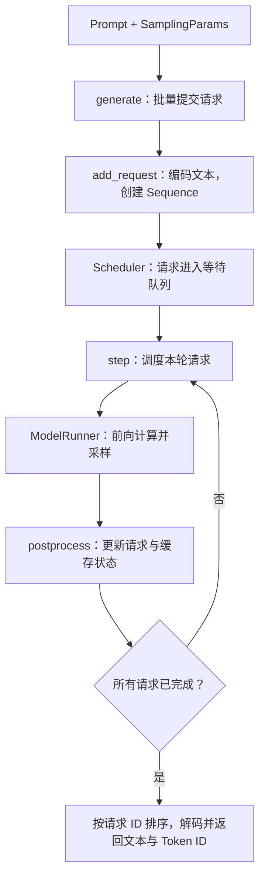

# 01 · 入口配置与生成主循环

先建立一次 generate 调用的整体印象；遇到调度器和执行器时先了解职责，后续章节再展开。

对应源码：[example.py](../source/nano-vllm/example.py)、[llm.py](../source/nano-vllm/nanovllm/llm.py)、[config.py](../source/nano-vllm/nanovllm/config.py)、[sampling_params.py](../source/nano-vllm/nanovllm/sampling_params.py)、[llm_engine.py](../source/nano-vllm/nanovllm/engine/llm_engine.py)。

## 本篇在做什么



**读图说明：** 这一层负责把一次 `generate()` 调用推进到所有请求完成。文本先被包装成 `Sequence`，随后循环调用 `step()`；每轮只推进选中的请求，最终按提交顺序整理输出。模型配置在引擎初始化时生效，温度和停止条件则随每条请求保存。

## example.py

```python
def main():
    # 展开本地模型目录；该路径需要已存在。
    path = os.path.expanduser("~/huggingface/Qwen3-0.6B/")
    # 加载词表和分词配置，负责文本与 Token ID 的转换。
    tokenizer = AutoTokenizer.from_pretrained(path)
    # 使用单卡 Eager 执行，关闭 CUDA Graph。
    llm = LLM(path, enforce_eager=True, tensor_parallel_size=1)

    # 温度控制随机性，每条请求最多生成 256 个 Token。
    sampling_params = SamplingParams(temperature=0.6, max_tokens=256)
    prompts = [
        "introduce yourself",
        "list all prime numbers within 100",
    ]
    prompts = [
        tokenizer.apply_chat_template(
            [{"role": "user", "content": prompt}],
            # 这里只生成模板文本，编码由引擎负责。
            tokenize=False,
            # 追加 assistant 回答的起始标记。
            add_generation_prompt=True,
        )
        for prompt in prompts
    ]
    # 提交整个批次，等待所有请求完成。
    outputs = llm.generate(prompts, sampling_params)

    for prompt, output in zip(prompts, outputs):
        print("\n")
        print(f"Prompt: {prompt!r}")
        print(f"Completion: {output['text']!r}")
```

**功能描述：** 演示批量文本生成的完整调用方式：加载模型与分词器，将用户输入套用对话模板，再调用引擎生成并展示回答。

## llm.py

```python
from nanovllm.engine.llm_engine import LLMEngine


# 直接继承引擎能力，不重写执行逻辑。
class LLM(LLMEngine):
    pass
```

**功能描述：** 通过继承提供简洁的公共接口，用户使用 LLM 即可调用 LLMEngine 的生成和请求管理方法。

## config.py

```python
@dataclass(slots=True)
class Config:
    # 必填的本地模型目录；下方断言要求目录存在。
    model: str
    # 每轮可调度的 Token 预算。
    max_num_batched_tokens: int = 16384
    # 每轮最多处理的序列数。
    max_num_seqs: int = 512
    # 单条序列的上下文长度上限。
    max_model_len: int = 4096
    # 显存预算比例，需共同容纳模型、运行开销和 KV Cache。
    gpu_memory_utilization: float = 0.9
    # 参与张量并行的 GPU 数量。
    tensor_parallel_size: int = 1
    # 为 True 时不捕获或回放 CUDA Graph。
    enforce_eager: bool = False
    # 保存模型架构与数据类型等配置。
    hf_config: AutoConfig | None = None
    # 由 tokenizer 的结束符 ID 替换初始占位值。
    eos: int = -1
    # 每个物理块可容纳的 Token 数。
    kvcache_block_size: int = 256
    # 占位值，预热和显存分析后确定。
    num_kvcache_blocks: int = -1

    def __post_init__(self):
        assert os.path.isdir(self.model)
        # 缓存块大小要求为 256 的整数倍。
        assert self.kvcache_block_size % 256 == 0
        # 该实现允许 1 到 8 路张量并行。
        assert 1 <= self.tensor_parallel_size <= 8
        self.hf_config = AutoConfig.from_pretrained(self.model)
        # 不超过模型自身支持的最大位置范围。
        self.max_model_len = min(
            self.max_model_len,
            self.hf_config.max_position_embeddings,
        )
```

**功能描述：** 集中保存引擎配置，并在构造后检查本地模型目录、缓存块大小和并行度，限制有效上下文长度。缓存块总数稍后由执行器根据显存预算填写。

## sampling_params.py

```python
@dataclass(slots=True)
class SamplingParams:
    # 温度越低通常越确定，越高分布越平坦。
    temperature: float = 1.0
    # 生成部分的最大 Token 数，不含 Prompt。
    max_tokens: int = 64
    # 为 True 时忽略 EOS，以生成长度上限作为停止条件。
    ignore_eos: bool = False

    def __post_init__(self):
        # 拒绝零温度及过小的温度值。
        assert self.temperature > 1e-10, "greedy sampling is not permitted"
```

**功能描述：** 定义单条请求的采样随机性与停止条件，供序列状态和采样器使用。该实现要求正温度，不提供温度为零的贪心采样。

## llm_engine.py

```python
# 引擎入口：连接 tokenizer、Scheduler 和 ModelRunner。
class LLMEngine:
```

**功能描述：** 声明对外组织请求、调度和模型执行的引擎类；后续片段依次展开其主要方法。

```python
    def __init__(self, model, **kwargs):
        # 只接受 Config 定义过的配置字段。
        config_fields = {field.name for field in fields(Config)}
        config_kwargs = {k: v for k, v in kwargs.items() if k in config_fields}
        config = Config(model, **config_kwargs)
        # 统一序列逻辑分块与物理缓存的块大小。
        Sequence.block_size = config.kvcache_block_size
        # 保存工作进程及其命令通知事件。
        self.ps = []
        self.events = []
        # 使用 spawn 启动独立的工作进程。
        ctx = mp.get_context("spawn")
        # rank 1 及以上在子进程中执行模型。
        for i in range(1, config.tensor_parallel_size):
            event = ctx.Event()
            process = ctx.Process(
                target=ModelRunner,
                args=(config, i, event),
            )
            process.start()
            self.ps.append(process)
            self.events.append(event)
        # 主进程负责 rank 0，同时协调其余 rank。
        self.model_runner = ModelRunner(config, 0, self.events)
        self.tokenizer = AutoTokenizer.from_pretrained(config.model, use_fast=True)
        # 从分词器取得请求终止符。
        config.eos = self.tokenizer.eos_token_id
        self.scheduler = Scheduler(config)
        # 进程退出时自动释放引擎资源。
        atexit.register(self.exit)
```

**功能描述：** 建立可接受生成请求的引擎实例，完成配置、并行工作进程、模型执行器、分词器和调度器的初始化，并注册退出清理。

```python
    def exit(self):
        # 向各 rank 分发退出命令。
        self.model_runner.call("exit")
        # 释放主进程持有的执行器引用。
        del self.model_runner
        for p in self.ps:
            # 等待对应子进程结束。
            p.join()
```

**功能描述：** 关闭模型执行器并等待并行工作进程退出，完成引擎生命周期的收尾。

```python
    def add_request(self, prompt: str | list[int], sampling_params: SamplingParams):
        # 字符串需要编码；已有 Token ID 列表直接使用。
        if isinstance(prompt, str):
            prompt = self.tokenizer.encode(prompt)
        # 将输入和采样设置封装为请求状态。
        seq = Sequence(prompt, sampling_params)
        # 进入等待队列，尚未运行模型。
        self.scheduler.add(seq)
```

**功能描述：** 将文本或已有 Token ID 包装成 Sequence 并放入等待队列。此方法只提交请求，实际计算由后续调度触发。

```python
    def step(self):
        # 选择本轮请求，并确定 Prefill 或 Decode 阶段。
        seqs, is_prefill = self.scheduler.schedule()
        # Prefill 记正数；Decode 记负数，供吞吐统计区分阶段。
        num_tokens = (
            sum(seq.num_scheduled_tokens for seq in seqs)
            if is_prefill
            else -len(seqs)
        )
        # 调用所有参与计算的 rank 执行本轮模型。
        token_ids = self.model_runner.call("run", seqs, is_prefill)
        # 更新生成结果、缓存进度和结束状态。
        self.scheduler.postprocess(seqs, token_ids, is_prefill)
        # 只收集本轮已完成请求的生成 Token。
        outputs = [
            (seq.seq_id, seq.completion_token_ids)
            for seq in seqs
            if seq.is_finished
        ]
        return outputs, num_tokens
```

**功能描述：** 推进一轮调度、模型计算与状态更新，返回本轮完成的请求及带阶段标记的 Token 计数。未完成的请求留待后续 step 继续执行。

```python
    def is_finished(self):
        # 将全局完成判断交给调度器。
        return self.scheduler.is_finished()
```

**功能描述：** 查询调度器是否还有待处理请求，作为生成主循环的终止条件。

```python
    def generate(
        self,
        prompts: list[str] | list[list[int]],
        sampling_params: SamplingParams | list[SamplingParams],
        use_tqdm: bool = True,
    ) -> list[str]:
        # use_tqdm 控制是否显示批次完成进度。
        pbar = tqdm(
            total=len(prompts),
            desc="Generating",
            dynamic_ncols=True,
            disable=not use_tqdm,
        )
        # 单套参数扩展到所有请求，也支持逐请求传参。
        if not isinstance(sampling_params, list):
            sampling_params = [sampling_params] * len(prompts)
        # 把每条输入及其采样设置加入等待队列。
        for prompt, sp in zip(prompts, sampling_params):
            self.add_request(prompt, sp)
        # 按请求 ID 收集结果，完成顺序可能不同于提交顺序。
        outputs = {}
        prefill_throughput = decode_throughput = 0.
        # 持续执行 step，直到等待队列和运行队列都为空。
        while not self.is_finished():
            # 记录本轮耗时，用于最近一轮的吞吐统计。
            t = perf_counter()
            output, num_tokens = self.step()
            # 正数为 Prefill，负数的绝对值为 Decode Token 数。
            if num_tokens > 0:
                prefill_throughput = num_tokens / (perf_counter() - t)
            else:
                decode_throughput = -num_tokens / (perf_counter() - t)
            # 更新两阶段最近一次测得的吞吐。
            pbar.set_postfix({
                "Prefill": f"{int(prefill_throughput)}tok/s",
                "Decode": f"{int(decode_throughput)}tok/s",
            })
            for seq_id, token_ids in output:
                outputs[seq_id] = token_ids
                pbar.update(1)
        pbar.close()
        # 按递增请求 ID 恢复输入顺序。
        outputs = [outputs[seq_id] for seq_id in sorted(outputs.keys())]
        outputs = [
            {
                # 将生成 Token 解码为文本，同时保留原始 ID。
                "text": self.tokenizer.decode(token_ids),
                "token_ids": token_ids,
            }
            for token_ids in outputs
        ]
        return outputs
```

**功能描述：** 批量提交请求并持续推进推理，直到所有请求完成；返回按提交顺序排列的文本与 Token ID 字典列表，同时展示进度和吞吐。片段中的返回类型注解沿用源码，实际元素是字典。

---

[学习目录](README.md) · [下一篇：请求状态与生命周期](02-Sequence-and-Lifecycle.md)
