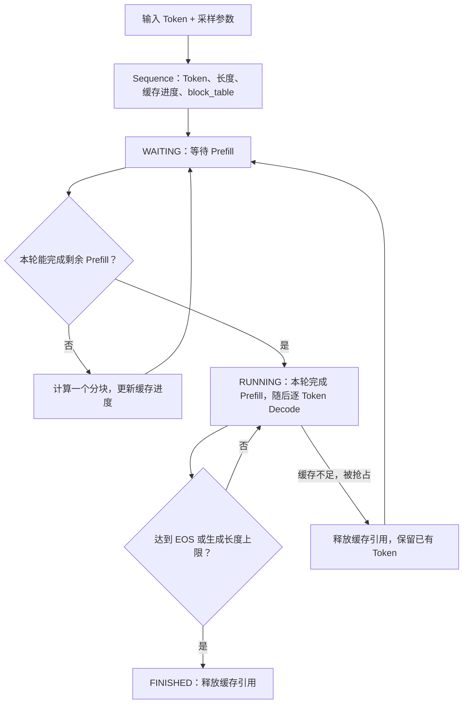

# 02 · 请求状态与生命周期

理解请求如何保存 Token、生成进度和缓存块映射，为缓存管理与调度打基础。

对应源码：[sequence.py](../source/nano-vllm/nanovllm/engine/sequence.py)。

## 本篇在做什么



**读图说明：** `Sequence` 是一条请求的状态记录，调度器负责改变它的状态。`WAITING / RUNNING / FINISHED` 描述队列生命周期，Prefill / Decode 描述计算阶段，两者并不完全等同：最后一个 Prefill 分块在调度时就会进入 RUNNING。生成出的新 Token 先追加到序列，其 KV 要到下一次前向才写入缓存；被抢占后则用保留的 Token 重新进行 Prefill。

## sequence.py

在 vLLM 一类推理框架中，一次生成请求通常可以抽象成：
```
Prompt Tokens
      ↓
Prefill 阶段：处理全部输入 token，构建 KV Cache
      ↓
Decode 阶段：每次生成一个新 token
      ↓
达到 EOS 或 max_tokens
      ↓
Finished
```
Sequence 就是这个请求在推理系统中的状态载体

```python
class SequenceStatus(Enum):
    # 等待 Prefill 或抢占后重算；auto 自动分配枚举值。
    WAITING = auto()
    # 已进入运行队列。
    RUNNING = auto()
    # 达到结束条件。
    FINISHED = auto()
```

**功能描述：** 定义请求生命周期的三种状态，供调度器决定请求是否等待、运行或结束。

```python
class Sequence:
    # 默认每块 256 个 Token，由引擎配置统一设置。
    block_size = 256
    # 每次 next 都产生一个新的递增序列 ID。
    counter = count()
```

**功能描述：** 设置序列共享的分块单位和 ID 生成器，使每条请求拥有可追踪的身份。

```python
    def __init__(
        self,
        token_ids: list[int],
        sampling_params=SamplingParams(),
    ):
        # 分配唯一 ID，并从等待状态开始。
        self.seq_id = next(Sequence.counter)
        self.status = SequenceStatus.WAITING
        # 复制 Token 列表，避免直接修改调用方的输入。
        self.token_ids = copy(token_ids)
        # 保存当前最后一个 Token，Decode 时用作模型输入。
        self.last_token = token_ids[-1]
        # 当前总长度包含 Prompt 和已生成部分。
        self.num_tokens = len(self.token_ids)
        # 固定的原始 Prompt 长度。
        self.num_prompt_tokens = len(token_ids)
        # 已经有 KV Cache 的 Token 数。
        self.num_cached_tokens = 0
        # 本轮准备计算的 Token 数。
        self.num_scheduled_tokens = 0
        # 新请求先执行 Prefill。
        self.is_prefill = True
        # 逻辑块编号到物理 KV Cache 块编号的映射。
        self.block_table = []
        # 保存请求独立的温度、生成长度上限和 EOS 策略。
        self.temperature = sampling_params.temperature
        self.max_tokens = sampling_params.max_tokens
        self.ignore_eos = sampling_params.ignore_eos
```

**功能描述：** 从输入 Token 和采样参数创建请求状态，后续调度、缓存管理与输出收集都围绕此对象更新。

```python
    def __len__(self):
        # 返回当前序列总长度。
        return self.num_tokens

    def __getitem__(self, key):
        # 支持单个下标或切片访问。
        return self.token_ids[key]
```

**功能描述：** 为请求对象提供长度查询和 Token 下标访问，让调度与分块代码可以直接使用 len(seq) 和 seq[key]。

```python
    @property
    def is_finished(self):
        # 根据枚举状态判断是否结束。
        return self.status == SequenceStatus.FINISHED

    @property
    def num_completion_tokens(self):
        # 总长度减去 Prompt 长度，得到生成长度。
        return self.num_tokens - self.num_prompt_tokens

    @property
    def prompt_token_ids(self):
        # 截取原始 Prompt。
        return self.token_ids[:self.num_prompt_tokens]

    @property
    def completion_token_ids(self):
        # 截取模型生成部分。
        return self.token_ids[self.num_prompt_tokens:]
```

**功能描述：** 提供完成状态、生成长度和输入/输出 Token 的统一查询接口，避免调用方重复计算边界。

```python
    @property
    def num_blocks(self):
        # 向上取整：不足一整块也要占用一个块。
        return (self.num_tokens + self.block_size - 1) // self.block_size

    @property
    def last_block_num_tokens(self):
        # 减去前面完整块的容量，得到末块实际长度。
        return self.num_tokens - (self.num_blocks - 1) * self.block_size

    def block(self, i):
        # 检查逻辑块下标有效。
        assert 0 <= i < self.num_blocks
        # 按块大小截取该逻辑块的 Token。
        return self.token_ids[
            i * self.block_size : (i + 1) * self.block_size
        ]
```

**功能描述：** 将 Token 序列转换成逻辑块视图，供缓存分配和前缀匹配计算所需块数及各块内容。

```python
    def append_token(self, token_id: int):
        # 将新结果追加到现有序列。
        self.token_ids.append(token_id)
        # 供下一轮 Decode 直接读取。
        self.last_token = token_id
        # 保持长度与列表内容同步。
        self.num_tokens += 1
```

**功能描述：** 接收一个新生成的 Token，并同步序列内容、最后一个 Token 和总长度。

```python
    def __getstate__(self):
        # 根据执行阶段选择完整列表或单个最新 Token。
        last_state = (
            self.last_token if not self.is_prefill else self.token_ids
        )
        # 同时传递长度、缓存进度和页表等执行元数据。
        return (
            self.num_tokens,
            self.num_prompt_tokens,
            self.num_cached_tokens,
            self.num_scheduled_tokens,
            self.block_table,
            last_state,
        )
```

**功能描述：** 生成跨进程传输所需的精简状态：Prefill 传递完整 Token 列表，Decode 只传递最新 Token，减少逐步生成时的通信量。

```python
    def __setstate__(self, state):
        (
            self.num_tokens,
            self.num_prompt_tokens,
            self.num_cached_tokens,
            self.num_scheduled_tokens,
            self.block_table,
            last_state,
        # 按序列化时约定的顺序解包。
        ) = state
        # 列表表示 Prefill，可据此读取本轮输入切片。
        if isinstance(last_state, list):
            self.token_ids = last_state
            self.last_token = self.token_ids[-1]
        else:
            # Decode 不传历史列表，只保存最新 Token。
            self.token_ids = []
            self.last_token = last_state
```

**功能描述：** 在工作进程中恢复模型执行所需的序列字段，与序列化格式配对使用。恢复对象只保留执行需要的状态。

---

[学习目录](README.md) · [上一篇：入口配置与生成主循环](01-Entry-and-Generation.md) · [下一篇：分页 KV Cache 与前缀缓存](03-Paged-KV-Cache-and-Prefix-Caching.md)
