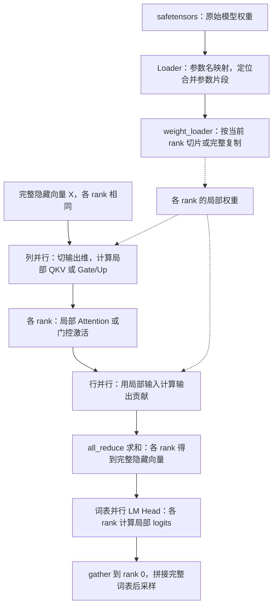

# 08 · 张量并行与权重加载

理解线性层和词表如何切分，以及原始权重如何装入合并参数和各 rank 分片。

对应源码：[linear.py](../source/nano-vllm/nanovllm/layers/linear.py)、[embed_head.py](../source/nano-vllm/nanovllm/layers/embed_head.py)、[loader.py](../source/nano-vllm/nanovllm/utils/loader.py)。

## 本篇在做什么



**读图说明：** 张量并行把同一层的计算分摊到多个 GPU。列并行产生局部特征，后续行并行对局部贡献求和，恢复各 rank 一致的隐藏向量；LM Head 则把各词表分片的 logits 收集到 rank 0。加载器必须采用与前向一致的切分规则，并把独立保存的 Q/K/V、Gate/Up 装入合并参数的对应区域。输入 Embedding 同样切分词表，查表后通过求和恢复完整向量。

## linear.py

该文件实现张量并行线性层。PyTorch 线性层的权重形状为：
```
[output_size, input_size]
```

```python
class ColumnParallelLinear(LinearBase):
    def __init__(...):
        # PyTorch 权重为 [输出维度, 输入维度]；这里切分输出维。
        super().__init__(
            input_size, output_size // tp_size, bias, 0
        )

    def forward(self, x):
        # 使用完整输入计算本 rank 的局部输出。
        return F.linear(x, self.weight, self.bias)
```

**功能描述：** 按输出特征维度切分线性层，每个 rank 产生部分输出，无需立即通信，适合 QKV 和 Gate/Up 投影。对应 weight_loader 沿权重第 0 维装入当前 rank 的分片。

补充示意：

```
完整 W = [W0; W1; ...]
每个 rank: Yi = X · Wi^T
```

```python
class RowParallelLinear(LinearBase):
    def __init__(...):
        # 仅保留本 rank 对应的输入维权重分片。
        super().__init__(
            input_size // tp_size, output_size, bias, 1
        )

    def forward(self, x):
        # 输入 x 已是当前 rank 的局部特征。
        y = F.linear(
            x, self.weight,
            # 仅 rank 0 加 Bias，避免求和时重复累加。
            self.bias if self.tp_rank == 0 else None,
        )
        if self.tp_size > 1:
            # 跨 rank 求和，各 rank 都获得完整输出。
            dist.all_reduce(y)
        return y
```

**功能描述：** 按输入特征维度切分线性层，各 rank 先计算局部贡献，再求和得到完整输出，适合 Attention 输出投影和 MLP 降维。

补充示意：

```
X = [X0, X1, ...]
W = [W0, W1, ...]
Y = Σ Xi · Wi^T
```

同文件中的其他线性层扩展了这套切分规则：`MergedColumnParallelLinear` 根据 `loaded_shard_id` 定位合并参数内部区域，再装入当前 rank 的分片；`QKVParallelLinear` 分别计算 Q/K/V 的大小与偏移，以适应不同的 Q Head 和 KV Head 数。`ReplicatedLinear` 则在各 rank 保存完整权重副本。

## embed_head.py

```python
class VocabParallelEmbedding(nn.Module):
    def __init__(self, num_embeddings, embedding_dim):
        # 每个 rank 的局部词表大小。
        self.num_embeddings_per_partition = (
            num_embeddings // self.tp_size
        )
        # 本 rank 的全局词表起点。
        self.vocab_start_idx = (
            self.num_embeddings_per_partition * self.tp_rank
        )
        # 区间右端点，不包含此索引。
        self.vocab_end_idx = (
            self.vocab_start_idx
            + self.num_embeddings_per_partition
        )
```

**功能描述：** 按连续词表区间分配 Embedding 权重，使每个 rank 只保存一部分 Token 的向量。

```python
if self.tp_size > 1:
    # 标记哪些 Token 属于当前 rank 的词表区间。
    mask = (
        (x >= self.vocab_start_idx)
        & (x < self.vocab_end_idx)
    )
    # 区间内转换为局部下标，区间外临时映射到 0。
    x = mask * (x - self.vocab_start_idx)
# 查询局部 Embedding 权重。
y = F.embedding(x, self.weight)
if self.tp_size > 1:
    # 清除区间外 Token 的临时查表结果。
    y = mask.unsqueeze(1) * y
    # 只有所属 rank 的向量有效，求和后恢复完整输出。
    dist.all_reduce(y)
```

**功能描述：** 将全局 Token ID 转成本地词表索引并查表，屏蔽不属于本 rank 的结果，再跨 rank 合并成完整 Embedding。

```python
class ParallelLMHead(VocabParallelEmbedding):
    def forward(self, x):
        # 读取当前阶段及变长序列边界。
        context = get_context()
        if context.is_prefill:
            # 累计边界减 1，得到每条序列最后一个 Query 的位置。
            last_indices = context.cu_seqlens_q[1:] - 1
            # 跳过不用于本轮采样的其他隐藏状态。
            x = x[last_indices].contiguous()
        # 用局部词表权重计算分片 logits。
        logits = F.linear(x, self.weight)
```

**功能描述：** 把隐藏状态投影到当前 rank 的词表分片。Prefill 仅为各序列本轮末尾位置计算 logits；完整实现随后将分片 Gather 到 rank 0，拼成完整词表供采样。

## loader.py

```python
def load_model(model: nn.Module, path: str):
    # 读取模型声明的合并参数映射，没有则用空字典。
    packed_modules_mapping = getattr(
        model, "packed_modules_mapping", {}
    )
    # 遍历模型目录内的权重分片文件。
    for file in glob(os.path.join(path, "*.safetensors")):
        # 以 CPU 为读取目标，后续按需取得单个 Tensor。
        with safe_open(file, "pt", "cpu") as f:
            # 逐个参数选择合适的装载方式。
            for weight_name in f.keys():
                ...
```

**功能描述：** 遍历本地 safetensors 权重文件和参数名，为逐参数加载提供入口，避免一次性把所有权重文件完整载入内存。

```python
for k in packed_modules_mapping:
    # 检查该原始参数是否属于合并投影。
    if k in weight_name:
        # 取得目标合并参数名及内部片段标识。
        v, shard_id = packed_modules_mapping[k]
        # 将原始名称转换成推理模型中的名称。
        param_name = weight_name.replace(k, v)
        param = model.get_parameter(param_name)
        # 读取绑定在目标参数上的专用加载函数。
        weight_loader = getattr(param, "weight_loader")
        weight_loader(
            # 传入原始 Tensor 和片段 ID，由 Loader 定位和切分。
            param, f.get_tensor(weight_name), shard_id
        )
        break
```

**功能描述：** 将独立保存的原始投影权重装入合并参数的正确区域，并由参数专用 Loader 完成当前张量并行 rank 的切片。

```python
else:
    # 直接按原权重名寻找模型参数。
    param = model.get_parameter(weight_name)
    # 并行层有专用 Loader，RMSNorm 等可用默认完整复制。
    weight_loader = getattr(
        param, "weight_loader", default_weight_loader
    )
    # 读取当前 Tensor，并装入对应参数。
    weight_loader(param, f.get_tensor(weight_name))
```

**功能描述：** 处理不属于合并映射的普通参数：优先使用参数自身的加载规则，否则完整复制权重，让新增层可以自行定义切分方式。

---

[学习目录](README.md) · [上一篇：Attention 与 KV Cache 读写](07-Attention-and-Cache-Access.md) · [下一篇：采样与输出 Token](09-Sampling.md)
