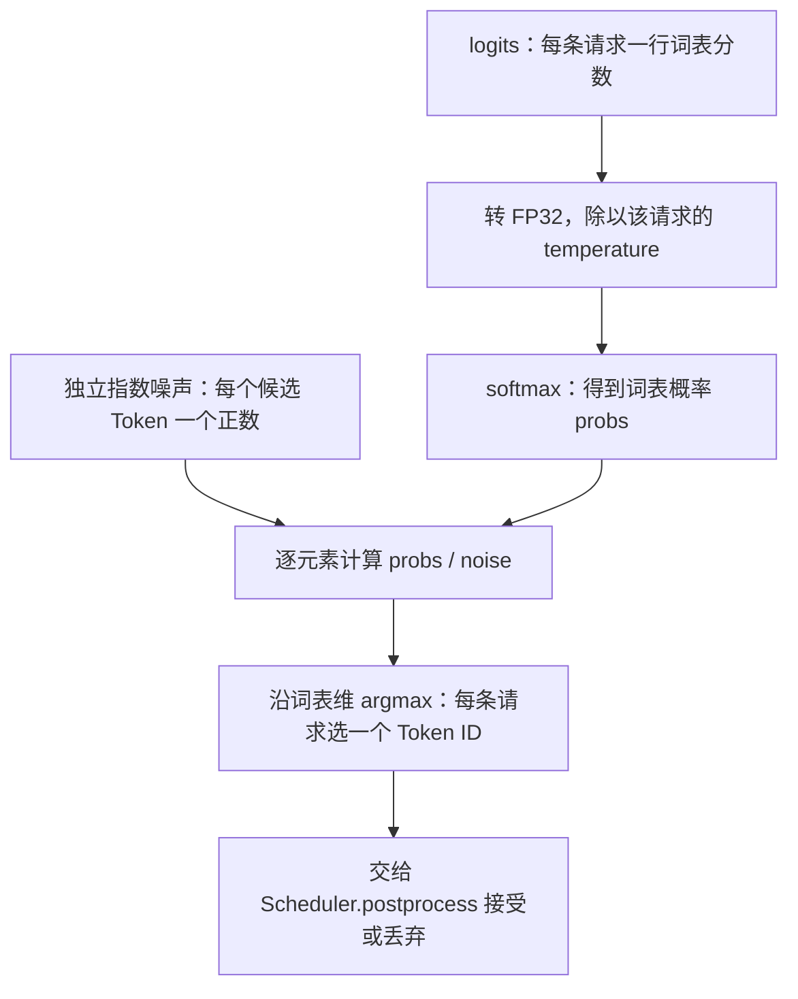

# 09 · 采样与输出 Token

接上 LM Head 的 logits，理解温度缩放与采样如何得到下一 Token。

对应源码：[sampler.py](../source/nano-vllm/nanovllm/layers/sampler.py)。

## 本篇在做什么



**读图说明：** 采样器把词表分数转换成下一 Token。温度改变概率分布的集中程度，独立指数噪声让最终选择遵循该分布；这里取最大的是“概率除以随机噪声”，并非直接挑最大概率。每条请求得到一个候选 Token，中间 Prefill 分块的候选会被调度器丢弃，其他有效结果则追加到请求。

## sampler.py

```python
# 转为 FP32，按每条序列的温度缩放整行词表 logits。
logits = logits.float().div_(temperatures.unsqueeze(1))
# 沿词表维归一化为概率。
probs = torch.softmax(logits, dim=-1)
# 比较 概率 / 指数噪声，最大者作为采样结果。
sample_tokens = probs.div_(
    # 每个候选 Token 独立生成指数噪声，并限制最小值。
    torch.empty_like(probs).exponential_(1).clamp_min_(1e-10)
).argmax(dim=-1)
```

**功能描述：** 将每条请求的 logits 转为温度控制的概率分布，再通过指数竞赛选出下一个 Token。理想情况下该方法等价于分类分布采样；实现用极小值截断避免除零。源码通过 `@torch.compile` 优化这些运算。温度越低分布通常越集中，该项目不支持零温度贪心采样。

---

[学习目录](README.md) · [上一篇：张量并行与权重加载](08-Tensor-Parallel-and-Weight-Loading.md) · [下一篇：一次 Step 的完整数据流](10-End-to-End-Step.md)
