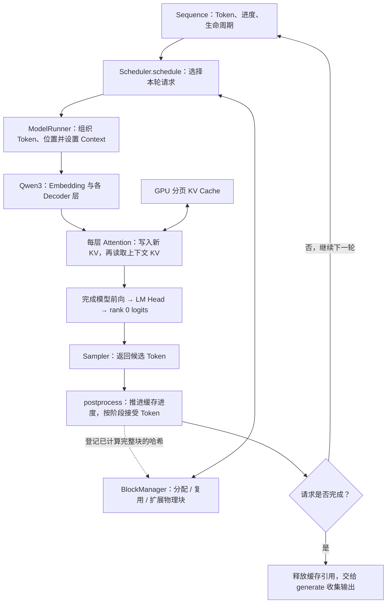

# 10 · 一次 Step 的完整数据流

回到完整执行链，串起请求状态、缓存管理、模型前向和采样，再回读第 01 篇的生成循环。

## 本篇在做什么



**读图说明：** 一次 `step()` 把调度决定转成实际 GPU 计算，再把计算结果写回请求状态。`Sequence` 保存跨轮次的请求信息，`BlockManager` 管理物理块元数据，`Context` 只描述本轮前向，GPU KV Cache 保存各层已经算出的 K/V。下面的调用链可与框图对照：Prefill 分块未完成时只推进缓存进度，Prefill 完成或 Decode 后才追加新 Token。

```
Scheduler.schedule()
    ↓ 选择 Sequence，分配/扩展 block_table
ModelRunner.prepare_prefill() / prepare_decode()
    ↓ 组织输入 Token、位置、缓存写入槽位与页表
set_context()
    ↓ 设置本轮各层共用的执行元数据
Qwen3 forward
    ↓ 每层 Attention 读取 Context
store_kvcache()
    ↓ 写入分页 KV Cache
FlashAttention
    ↓ 得到注意力输出，继续经过模型后续层得到隐藏状态
ParallelLMHead
    ↓ rank 0 获得完整 logits
Sampler
    ↓ 根据温度采样下一 Token
Scheduler.postprocess()
    ↓ 更新 Sequence、哈希完整块、结束或进入下一轮
```

**功能描述：** 展示一次 Step 如何从选择请求推进到更新生成结果，并把未完成请求留给下一轮。整条链路通过以下三类状态衔接：

- `Sequence`：一条请求的 Token 和生命周期状态
- `BlockManager`：CPU 侧 KV Cache 页表、引用计数和前缀哈希
- `Context`：当前一次 GPU 前向需要的临时批量元数据

三者通过 `Scheduler` 和 `ModelRunner` 串联起来，实现了连续批处理、Chunked Prefill、Paged KV Cache、前缀缓存、张量并行和 CUDA Graph Decode。

---

[学习目录](README.md) · [上一篇：采样与输出 Token](09-Sampling.md)
